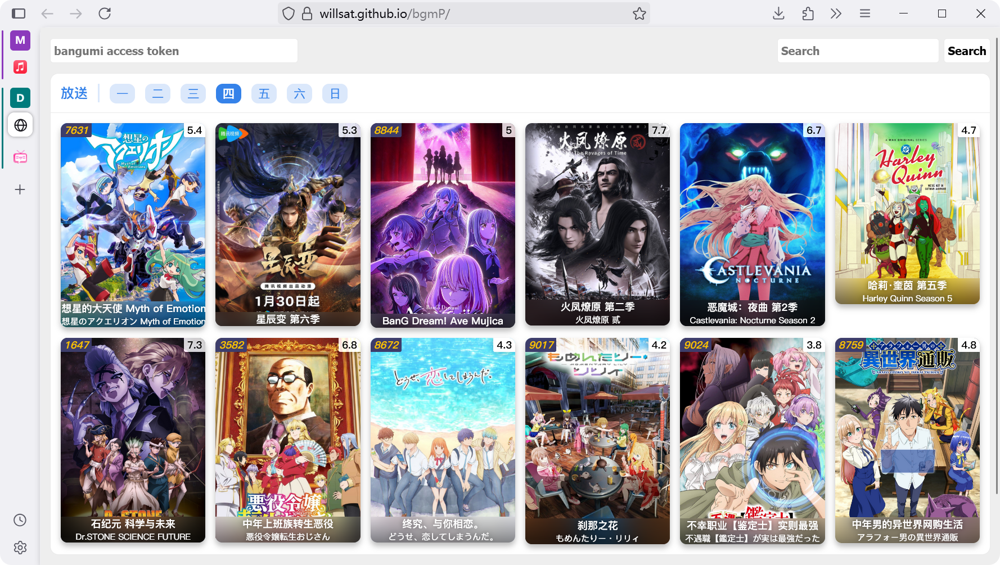
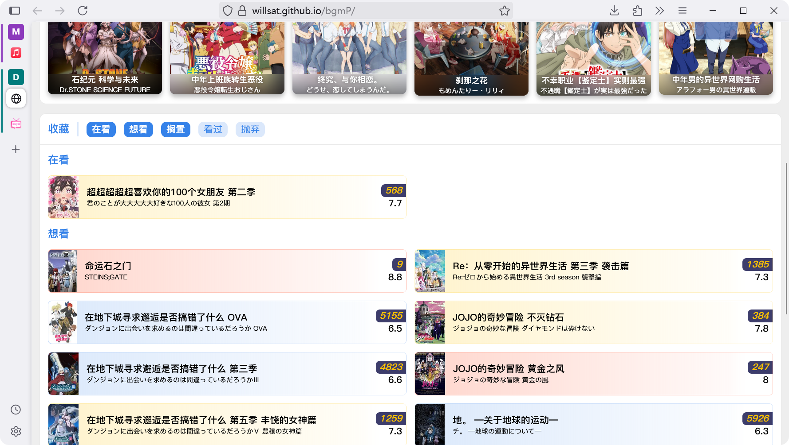
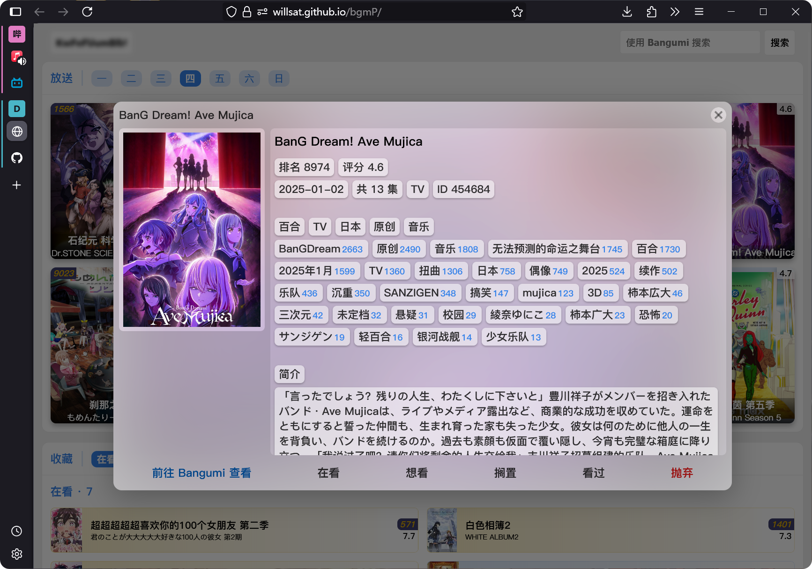

# bgmP

这是一个 Bangumi 第三方网页。 

项目主要目的是锻炼 Git 主的前端能力和审美，随缘更新，欢迎骚扰。

<table>
<tr>
<td></td>
<td></td>
</tr>
<tr>
<td></td></tr>
</table>

## 使用方法

1. 进入 [GitHub Pages](https://willsat.github.io/bgmP/)
2. 网址后添加 `#` + `Access Token`  

> 例如：**https://willsat.github.io/bgmP/`#KwFeFUumghghBlbWso7afnYb70OaahavTc3Z1WLs7iI`**

> 如何获取 Access Token?  
> [创建个人令牌](https://next.bgm.tv/demo/access-token)

## 声明

*该项目仅用于学习用途，如有侵权请联系我：waitwill@icloud.com*